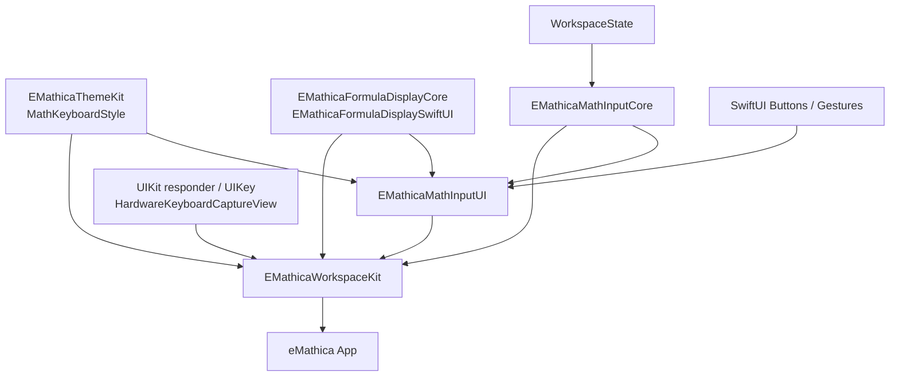

# FormulaKeyboard Current Architecture Audit

## Scope

This audit covers the current production and transitional formula-keyboard implementation across:

- `SharedLibraries/EMathicaMathInputKit`
- `SharedLibraries/EMathicaWorkspaceKit`
- `SharedLibraries/EMathicaThemeKit`
- `eMathica`

This document is read-only. It describes current runtime architecture, not desired architecture.

## 1. Module And Directory Reality

### 1.1 Package / target split

| Module | Package / Target | Current keyboard responsibility | Public API reality |
|---|---|---|---|
| MathInput core | `EMathicaMathInputCore` | Key definition model, token/action vocabulary, hardware semantic mapping, AST editing, cursor movement, projection bridge | Public, production-used |
| MathInput UI | `EMathicaMathInputUI` | Production touch keyboard SwiftUI surface, key/panel/label rendering, alphabet runtime panel | Public target, despite package docs still calling it placeholder |
| Workspace | `EMathicaWorkspaceKit` | Formula editor session, keyboard container mounting, hardware key capture ingress, action dispatch, legacy keyboard isolation, formula preview integration | Public package, production-used |
| Theme | `EMathicaThemeKit` | Keyboard style tokens, spacing, typography, opacity constants | Public package |
| App layer | `eMathica` app target and tests | Workspace mounting, UI acceptance tests, product-level behavior verification | App consumer |

### 1.2 Keyboard-related file inventory

#### `EMathicaMathInputCore`

| File | Role | API level |
|---|---|---|
| `Sources/EMathicaMathInputCore/Keyboard/MathKeyboardKey.swift` | `MathKeyboardKey`, `MathKeyboardIntent`, `intent -> KeyboardAction` bridging | Public |
| `Sources/EMathicaMathInputCore/Keyboard/MathKeyboardLabel.swift` | Label descriptor model: `.text`, `.symbol`, `.formula`, `.systemIcon` | Public |
| `Sources/EMathicaMathInputCore/Keyboard/MathKeyboardLayout.swift` | Static panel/row/key definitions for numbers, functions, symbols; helper builders; legacy template escape hatches | Public |
| `Sources/EMathicaMathInputCore/Keyboard/HardwareKeyboardSemanticMapper.swift` | Hardware descriptor -> `MathKeyboardIntent` semantic mapping | Public |
| `Sources/EMathicaMathInputCore/PublicProtocol/MathInputToken.swift` | Public token vocabulary | Public |
| `Sources/EMathicaMathInputCore/AST/MathEditorState.swift` | `EditorCursor`, `KeyboardAction`, editing state | Public |
| `Sources/EMathicaMathInputCore/AST/MathEditorAST.swift` | AST structure, `TemplateKind`, `FieldID` | Public |
| `Sources/EMathicaMathInputCore/Engine/MathEditorEngine.swift` | `InputController`, AST mutation, template insertion, deletion rules | Public |
| `Sources/EMathicaMathInputCore/Engine/TemplateDefinition.swift` | Template field/tab/arrow semantics | Public |
| `Sources/EMathicaMathInputCore/Projection/MathFormulaProjection.swift` | AST -> structural `MathFormula` snapshot | Internal production bridge |
| `Sources/EMathicaMathInputCore/Projection/FormulaDisplayBridge.swift` | `MathFormula` -> `FormulaDisplayDocument` and insertion mapping | Internal production bridge |
| `Sources/EMathicaMathInputCore/State/MathInputSession.swift` | Public session facade using token/action entrypoints | Public |
| `Sources/EMathicaMathInputCore/Serialization/MathInputCharacterNormalizer.swift` | Character normalization used by public token/session input | Public |

#### `EMathicaMathInputUI`

| File | Role | API level |
|---|---|---|
| `Sources/EMathicaMathInputUI/MathInputKeyboardView.swift` | Production touch keyboard container, tab bar, panel switching, `onIntent` / `onAction` overloads | Public |
| `Sources/EMathicaMathInputUI/MathInputKeyboardSurfaceModel.swift` | Runtime panel state, alphabet script/case switching, dynamic alphabet rows | Internal |
| `Sources/EMathicaMathInputUI/MathInputKeyboardPanelView.swift` | Row layout using `GeometryReader` + width weights | Internal |
| `Sources/EMathicaMathInputUI/MathInputKeyboardKeyView.swift` | Button shell, pressed-state tracking via drag gesture | Internal |
| `Sources/EMathicaMathInputUI/MathInputKeyboardLabelView.swift` | Switches between formula/system/text rendering | Internal |
| `Sources/EMathicaMathInputUI/MathKeyboardFormulaLabelView.swift` | SwiftMath/FormulaDisplay-backed key label rendering with probe-first fallback | Internal |
| `Sources/EMathicaMathInputUI/MathInputKeyboardStyleBridge.swift` | Visual role inference, label presentation routing, FormulaDisplay metrics/style bridge | Internal |

#### `EMathicaWorkspaceKit`

| File | Role | API level |
|---|---|---|
| `Sources/EMathicaWorkspaceKit/WorkspaceView.swift` | Mounts `MathInputKeyboardView` as production keyboard; mounts formula editor preview surface | Public |
| `Sources/EMathicaWorkspaceKit/WorkspaceState.swift` | Central dispatcher from keyboard actions into editor session and preview sync | Internal production state owner |
| `Sources/EMathicaWorkspaceKit/Input/FormulaEditingDisplayView.swift` | Production editor preview stack; hosts `FormulaDisplayPreviewView`, interaction overlay, hardware key capture | Public |
| `Sources/EMathicaWorkspaceKit/Input/FormulaDisplayPreviewView.swift` | Preview bridge from `FormulaInputState` into `FormulaDisplayView` | Public |
| `Sources/EMathicaWorkspaceKit/Input/HardwareKeyboardCaptureView.swift` | UIKit responder ingress, physical key event capture, mapper forwarding | Public on UIKit builds |
| `Sources/EMathicaWorkspaceKit/Input/MathPlainTextField.swift` | Hidden / textual UIKit text-field path, direct source-string editing support | Public |
| `Sources/EMathicaWorkspaceKit/Keyboard/FormulaEditorView.swift` | Legacy AST-layout interaction overlay and hit region generation | Public |
| `Sources/EMathicaWorkspaceKit/Keyboard/FormulaInputState.swift` | Workspace-facing formula editing snapshot, source/display/compute/semantic state bundle | Public |
| `Sources/EMathicaWorkspaceKit/StructuredInput/FormulaCursorNavigationResolver.swift` | Direction-key resolver using projection insertion order plus fallback | Internal production navigation |
| `Sources/EMathicaWorkspaceKit/StructuredInput/EditorCursorNavigator.swift` | AST/template-aware fallback navigation | Public struct but production fallback logic |
| `Sources/EMathicaWorkspaceKit/Input/MathInputProjectionAdapter.swift` | Workspace adapter from `FormulaInputState` to `MathFormula` / display snapshots | Internal |
| `Sources/EMathicaWorkspaceKit/Legacy/Keyboard/MathKeyboardView.swift` | Deprecated legacy keyboard surface | Legacy |
| `Sources/EMathicaWorkspaceKit/Legacy/Keyboard/KeyboardKey.swift` | Deprecated legacy key model | Legacy |
| `Sources/EMathicaWorkspaceKit/Legacy/Keyboard/WorkspaceMathKeyboardAdapter.swift` | Adapter from new core layout to legacy key model | Transitional legacy |
| `Sources/EMathicaWorkspaceKit/Legacy/Keyboard/MathKeyboardLayout.swift` | Legacy tab abstraction | Legacy |

#### `EMathicaThemeKit`

| File | Role | API level |
|---|---|---|
| `Sources/EMathicaThemeKit/MathKeyboardStyle.swift` | Panel, key, tab, typography, spacing token bag | Public |

#### Tests

| File | Current purpose |
|---|---|
| `EMathicaMathInputKit/Tests/EMathicaMathInputCoreTests/MathKeyboardSemanticModelTests.swift` | Static layout expectations, label model, function/symbol coverage |
| `EMathicaMathInputKit/Tests/EMathicaMathInputCoreTests/HardwareKeyboardSemanticMapperTests.swift` | Hardware descriptor -> semantic intent |
| `EMathicaMathInputKit/Tests/EMathicaMathInputUITests/MathInputKeyboardViewTests.swift` | Surface model, alphabet panel, label routing |
| `EMathicaWorkspaceKit/Tests/EMathicaWorkspaceKitTests/MathInputKeyboardAdoptionTests.swift` | Workspace can initialize new keyboard view; intent-to-action bridge assumptions |
| `EMathicaWorkspaceKit/Tests/EMathicaWorkspaceKitTests/MathKeyboardLayoutTests.swift` | Production surface uses new keyboard, legacy files remain isolated |
| `EMathicaWorkspaceKit/Tests/EMathicaWorkspaceKitTests/FormulaCursorNavigationResolverTests.swift` | Direction navigation semantics through projection snapshot |
| `eMathica/eMathicaTests/PlaneCompactKeyboardPolishTests.swift` and `eMathica/eMathicaTests/eMathicaTests.swift` | App-level acceptance/regression paths touching formula input and workspace behavior |

### 1.3 Current dependency graph

### 1.4 Reverse dependency pressure

- `EMathicaMathInputUI` depends on FormulaDisplay for key labels, so keyboard rendering is already coupled to the formula renderer.
- `EMathicaWorkspaceKit` owns hardware ingress and editing dispatch, so the keyboard framework is not self-contained.
- `MathKeyboardIntent.keyboardAction` is defined in MathInput core but tuned for Workspace editing semantics.
- `EMathicaMathInputKit/README.md` and `Architecture.md` still describe `EMathicaMathInputUI` as a placeholder target, which no longer matches reality.

## 2. Current Input Event Pipelines

### 2.1 Touch keyboard: plain character or number

`WorkspaceView.keyboardPanel`
-> `MathInputKeyboardView(onAction:)`
-> `MathInputKeyboardPanelView`
-> `MathInputKeyboardKeyView.Button`
-> `MathInputKeyboardSurfaceModel.handle`
-> `MathInputKeyboardSurfaceModel.forward`
-> `MathKeyboardIntent.keyboardAction`
-> `WorkspaceState.handleKeyboardAction`
-> `InputController.handle`
-> `EditorState.root/cursor`
-> `FormulaInputState.syncDerivedStrings`
-> `FormulaDisplayPreviewView`
-> `FormulaDisplayView`

Reality notes:

- The production touch path does not use `MathInputSession.input(_ token)` even though that public protocol exists.
- `MathInputKeyboardView(onAction:)` immediately collapses `MathKeyboardIntent` into `KeyboardAction`.
- `WorkspaceState` is the real command boundary in production, not `MathInputSession`.

### 2.2 Touch keyboard: template insertion

Same path until `MathKeyboardIntent.keyboardAction`, then:

- `.input(.template(.sqrt))` -> `.insertTemplate(.sqrt)`
- `.input(.function("sin"))` -> `.insertFunction("sin")`
- `.action(.insertTemplate(.piecewise(rows: 2)))` for legacy formula-template keys

Then:

`WorkspaceState.handleKeyboardAction`
-> `InputController.insertTemplate`
-> `TemplateDefinitionRegistry`
-> AST mutation
-> sync / projection / display refresh

Reality notes:

- Built-in keys are split across token-driven and direct-action-driven templates.
- Parametric and piecewise still use direct `.action(.insertTemplate(...))` instead of tokenized template IDs.
- Keyboard definition is therefore not normalized to one command vocabulary.

### 2.3 Touch keyboard: left/right move

`MathInputKeyboardKeyView`
-> `.action(.moveLeft/.moveRight)`
-> `WorkspaceState.handleKeyboardAction`
-> `ensureValidCursor`
-> `FormulaCursorNavigationResolver.resolve`
-> if resolver succeeds, write `session.editorState.cursor`
-> else `InputController.handle(.moveLeft/.moveRight)` fallback
-> `formulaInputState.editorState = session.editorState`
-> projection snapshot and FormulaDisplay refresh
-> visible cursor overlay update

Reality notes:

- Direction navigation is not performed inside the keyboard layer.
- View code does not know navigation semantics; `WorkspaceState` and resolver own them.
- Navigation and rendering are coupled through `FormulaDisplayProjectionSnapshot` and cursor/insertion IDs.

### 2.4 Touch keyboard: delete

`MathInputKeyboardKeyView`
-> `.action(.deleteBackward)`
-> `WorkspaceState.handleKeyboardAction`
-> `FormulaCursorNavigationResolver.resolve` returns `nil`
-> `InputController.handle(.deleteBackward)`
-> `InputController.backspace`
-> AST normalization / placeholder repair
-> sync / preview refresh

Reality notes:

- Delete is single-shot only in the current new keyboard surface.
- No production long-press repeat loop exists in `MathInputKeyboardKeyView`.
- Delete behavior semantics live in `InputController`, not in the key view.

### 2.5 Keyboard page switching

`MathInputKeyboardView`
-> tab `Button`
-> `surfaceModel.select(panelID:)`
-> `surfaceModel.visiblePanel`
-> rerender panel view

Alphabet panel special case:

- static layout panel rows are empty
- `MathInputKeyboardSurfaceModel.visiblePanel` replaces the panel rows at runtime with `alphabetRows`
- case/script toggles mutate local UI state only via `.none` intent keys

Reality notes:

- Page switching is UI-local state, not part of the editor command boundary.
- Alphabet case/script toggles are not expressed as editor actions.

### 2.6 Hardware keyboard path

`FormulaEditingDisplayView.background`
-> `HardwareKeyboardCaptureView`
-> `KeyCaptureView.pressesBegan`
-> `KeyboardHardwareMapper.map`
-> `HardwareKeyboardSemanticMapper.intent`
-> `MathKeyboardIntent.keyboardAction`
-> `WorkspaceState.handleKeyboardAction`
-> same editor mutation and preview refresh path as touch keyboard

Reality notes:

- Hardware input converges with touch input only at `KeyboardAction`.
- Physical key capture lives in WorkspaceKit, semantic mapping lives in MathInputCore.
- The public `MathInputToken` input protocol is again bypassed in production.

### 2.7 Plain text field path

`MathPlainTextField`
-> UIKit text changes
-> `WorkspaceState.dispatch(.updateInputText)`
-> incremental diff detection
-> `handleKeyboardAction(.insertCharacter/.deleteBackward)` for simple deltas
-> else direct AST rebuild via `SimpleMathParser` or direct root replacement

Reality notes:

- This is a third input route, separate from touch keyboard and hardware keyboard.
- Non-incremental text replacement can bypass structured keyboard semantics entirely.

## 3. Key Type Inventory And Current Modeling

### 3.1 Actual key categories in production data

| Current category | Example ids | Current model |
|---|---|---|
| Plain alphanumeric math keys | `numbers-x`, `numbers-7`, alphabet rows | `.symbol(markup:, fallback:)` + `.input(.char/.number)` |
| Operator keys | `numbers-plus`, `numbers-mul`, `symbols-leq` | `.symbol(...)` + `.input(.op)` |
| Symbol insertion keys | `numbers-pi`, `symbols-infty`, Greek rows | `.symbol(...)` + `.action(.insertSymbol(...))` or `.input(.char)` for shared glyphs |
| Function keys | `functions-sin`, `numbers-log` | `.formula(markup:)` + `.input(.function)` |
| Template keys | sqrt, fraction, superscript, absolute value | `.formula(markup:)` + `.input(.template)` |
| Legacy direct template keys | `functions-parametric-2d`, `functions-piecewise` | `.formula(markup:)` + `.action(.insertTemplate(kind))` |
| System command keys | delete, arrows, submit | `.systemIcon` + `.action(KeyboardAction)` |
| Mode / page toggles | tab titles, alphabet case toggle, alphabet script toggle | tab buttons in `MathInputKeyboardView`; toggle keys use `.none` intent and mutate `MathInputKeyboardSurfaceModel` |
| Accent / wide keys | submit, equals, toggles | size + id-suffix heuristics |

### 3.2 Repetition and special branching

- Display semantics are duplicated between `MathKeyboardLayout.swift` and `MathInputKeyboardSurfaceModel.swift`.
- Alphabet panel is not fully defined in the core layout model.
- Hardware symbols are normalized in `HardwareKeyboardSemanticMapper.swift`, separate from touch key definitions.
- Legacy adapter still derives title/subtitle text from core keys through `WorkspaceMathKeyboardAdapter`.
- Visual roles are inferred from label type and key id suffix, not declared in the key definition.

### 3.3 Key types that are only historically special

The following special cases are historical rather than conceptually required:

- Legacy `KeyboardKey(title/subtitle/action)` model.
- Static empty alphabet panel replaced at runtime.
- Direct-action parametric/piecewise keys bypassing token vocabulary.
- Accent detection based on id suffix instead of explicit semantic role.

These should not be preserved as long-term framework types.

## 4. Layout Reality

### 4.1 Production layout model

- Panel level: vertical stack in `MathInputKeyboardView`
- Tab bar: `HStack`
- Rows: `MathInputKeyboardPanelView` uses `GeometryReader` per row
- Key width: weight-based computation from `MathKeyboardKeySize`
- Key height: fixed `style.spacing.keyMinHeight`
- Panel padding: fixed values from `MathKeyboardStyle.spacing`

### 4.2 Current limitations

- There is no explicit placement model such as row/column/span.
- There is no keyboard-wide layout schema validation.
- Alphabet layout is partly data-driven, partly runtime-generated.
- Device/layout variants are indirect and mostly delegated to outer Workspace sizing.
- No separate layout engine layer exists; layout is embedded in SwiftUI view code.

### 4.3 What belongs in the future framework

Current behavior indicates the following future layers are missing:

- `FormulaKeyboardLayoutDefinition`
- `FormulaKeyboardLayoutVariant`
- `FormulaKeyboardLayoutEngine`
- `FormulaKeyboardMetrics`

The current weighted-row layout can be represented as a compatibility variant, but it is not a sufficient long-term architecture boundary.

## 5. Rendering Reality

### 5.1 Current render entry selection

`MathInputKeyboardLabelView` selects one of:

- `MathKeyboardFormulaLabelView`
- `Image(systemName:)`
- `Text`

### 5.2 Formula label rendering path

`MathKeyboardFormulaLabelView`
-> `FormulaReadOnlyRenderProbe.measure(...)`
-> if success: `FormulaDisplayView(rawValue: markup, ...)`
-> `FormulaDisplayContentResolver`
-> SwiftMath snapshot path

### 5.3 Current rendering issues

- Formula markup is probed before rendering, then parsed again during actual `FormulaDisplayView` creation.
- Pressed-state updates in `MathInputKeyboardKeyView` can trigger body recomputation, so the probe path can rerun during interaction.
- Key rendering is still a view concern; no reusable renderer abstraction exists between definition and SwiftUI.
- Page tab titles still use `Text`, not a unified content model.
- Formula label layout metrics are inferred from visual role in `MathInputKeyboardStyleBridge`, not declared per key content complexity.

### 5.4 Renderer coupling

- Keyboard rendering depends directly on FormulaDisplay/SwiftMath.
- Renderer is not isolated from visual role heuristics.
- Renderer does not expose a keyboard-specific cache boundary.

## 6. Interaction, Behavior, And Animation Reality

### 6.1 Touch interaction

Current production key interaction is:

- `Button` activation for action dispatch
- `DragGesture(minimumDistance: 0)` only to toggle local `isPressed`

There is currently no production implementation for:

- long press alternate actions
- repeat while pressed
- acceleration
- gesture cancellation state machine
- move-out cancel / move-back resume
- pointer-specific hover behavior in the new keyboard surface

### 6.2 Animation

- Key press effect is `scaleEffect(isPressed ? 0.985 : 1.0)`.
- Durations and motion policies are implicit in SwiftUI transactions.
- No reduce-motion integration exists in the keyboard layer.
- Animation is attached directly to view state rather than routed through a behavior model.

### 6.3 Behavior ownership

Current behavior is split between:

- local view pressed-state
- `MathInputKeyboardSurfaceModel` local page/case/script state
- `WorkspaceState.handleKeyboardAction`
- `InputController`
- `FormulaCursorNavigationResolver`

There is no single `Press Session -> Behavior -> Action` pipeline.

## 7. Theme, Environment, And Metrics Reality

### 7.1 Good current foundation

`MathKeyboardStyle` centralizes:

- panel styling
- key styling
- tab styling
- typography
- spacing

This is the strongest current candidate for migration into framework environment/metrics/theme layers.

### 7.2 Current fragmentation

Despite `MathKeyboardStyle`, many values remain outside a unified environment boundary:

- formula label layout metrics are hard-coded in `MathInputKeyboardStyleBridge`
- system fonts are chosen inline in multiple views
- `MathKeyboardVisualMetrics` duplicates style-to-CGFloat extraction for legacy views
- `FormulaEditingDisplayView` and outer Workspace layout still determine some keyboard hosting geometry separately

### 7.3 Current environment gaps

Missing framework-level environment concepts:

- platform variant
- compact / regular keyboard layout variant
- system preference injection
- content size category response
- reduce motion policy
- contrast / transparency policy
- pointer / hardware availability flags

## 8. Serialization And Extensibility Reality

### 8.1 Current model is not serialization-ready

Current keyboard core structures are `Equatable` / `Sendable`, but not a stable serializable schema:

- `MathKeyboardKey` is not `Codable`
- `MathKeyboardIntent` is not `Codable`
- `KeyboardAction` is not `Codable`
- `MathKeyboardLayout` is code-built rather than data-loaded
- alphabet panel is partially runtime-generated

### 8.2 Current non-serializable assumptions

- UI-local closures are still the real dispatch mechanism.
- Runtime `MathInputKeyboardSurfaceModel` owns mutable page/script/case state.
- Formula rendering config is injected through view construction rather than data schema.
- Some key semantics are encoded through helper functions and naming conventions.

### 8.3 Stable identifiers that already exist

- `MathKeyboardKey.id`
- panel ids
- alphabet toggle ids
- `FormulaInsertionID`
- `EditorCursor.path + offset`
- `FieldID`
- `TemplateKind`

These are usable inputs for a future schema, but the current framework does not yet organize them into a serializable keyboard definition model.

## 9. Current Coupling Findings

### 9.1 View directly modifying editor behavior

The new keyboard does not directly mutate AST, but views still directly decide:

- which local surface state mutates on press
- which intents never reach the dispatcher (`.none` toggle keys)
- which rendering path is used

### 9.2 Production action path divergence

There are currently at least three real input routes:

1. touch keyboard
2. hardware keyboard
3. plain text source field

All three eventually touch `WorkspaceState`, but they do not begin from a unified framework dispatcher or shared declarative key schema.

### 9.3 FormulaDisplay over-coupling

- Keyboard content rendering directly depends on FormulaDisplay.
- FormulaDisplay is asked to parse static label markup repeatedly.
- No dedicated keyboard renderer cache or precompiled document layer exists.

## 10. Summary Of Current Architecture Reality

### Keepable parts

- `MathKeyboardKey.id`
- label descriptor shape
- `KeyboardAction` / `MathInputToken` vocabulary as migration input
- ThemeKit style tokens as seed material
- `WorkspaceState.handleKeyboardAction` as current central production dispatcher
- AST/template structure and cursor/path model

### Must-replace parts

- mixed static/runtime definition split between layout file and surface model
- lack of validation layer
- row-view-driven layout as the only layout engine
- direct FormulaDisplay probe + render double parsing
- view-local interaction and pressed-state behavior
- hardware ingress converging only at `KeyboardAction`, not at a keyboard framework dispatcher
- legacy adapter / legacy view duality
- single-string accessibility labels as the only semantic affordance
