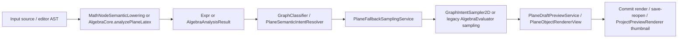

# Graph Quality Baseline Report

## 1. 本轮是否修改源码

否。

本轮只新增本报告文档，没有修改任何 Swift 源码、项目配置或目录结构。

## 2. 审计范围

本轮重点检查了以下模块和文件：

- 能力与阶段文档
  - `Docs/EMathicaGeoGebraCapabilityMatrix.md`
  - `Docs/PlaneMVPRegressionReport.md`
  - `Docs/PlaneUIPolishRegressionReport.md`
  - `eMathica/Docs/EMathicaCurrentArchitectureAudit.md`
- MathCore / GraphCore / SamplingCore
  - `Packages/EMathicaMathCore/Sources/EMathicaMathCore/SemanticCore/Expr.swift`
  - `Packages/EMathicaMathCore/Sources/EMathicaMathCore/SemanticCore/MathFunction.swift`
  - `Packages/EMathicaMathCore/Sources/EMathicaMathCore/GraphCore/GraphIntent.swift`
  - `Packages/EMathicaMathCore/Sources/EMathicaMathCore/GraphCore/GraphClassifier.swift`
  - `Packages/EMathicaMathCore/Sources/EMathicaMathCore/EvaluationCore/ExprEvaluator.swift`
  - `Packages/EMathicaMathCore/Sources/EMathicaMathCore/EvaluationCore/ConditionEvaluator.swift`
  - `Packages/EMathicaMathCore/Sources/EMathicaMathCore/SamplingCore/Sampling2D/GraphIntentSampler2D.swift`
  - `Packages/EMathicaMathCore/Sources/EMathicaMathCore/SamplingCore/Sampling2D/ExplicitFunctionSampler2D.swift`
  - `Packages/EMathicaMathCore/Sources/EMathicaMathCore/SamplingCore/Sampling2D/ImplicitCurveSampler2D.swift`
  - `Packages/EMathicaMathCore/Sources/EMathicaMathCore/SamplingCore/Sampling2D/ParametricCurveSampler2D.swift`
  - `Packages/EMathicaMathCore/Sources/EMathicaMathCore/SamplingCore/Sampling2D/PolarCurveSampler2D.swift`
  - `Packages/EMathicaMathCore/Sources/EMathicaMathCore/SamplingCore/Sampling2D/PiecewiseSampler2D.swift`
  - `Packages/EMathicaMathCore/Sources/EMathicaMathCore/AlgebraCore/AlgebraCore.swift`
  - `Packages/EMathicaMathCore/Sources/EMathicaMathCore/AlgebraCore/Parsing/AlgebraLatexParser.swift`
  - `Packages/EMathicaMathCore/Sources/EMathicaMathCore/AlgebraCore/Parsing/AlgebraLatexLexer.swift`
- Plane graphing / preview / renderer / thumbnail
  - `eMathica/CalculatorModules/Plane/Services/PlaneExpressionService.swift`
  - `eMathica/CalculatorModules/Plane/Services/PlaneDraftPreviewService.swift`
  - `eMathica/CalculatorModules/Plane/Services/PlaneSemanticIntentResolver.swift`
  - `eMathica/CalculatorModules/Plane/Services/PlaneSemanticPreviewPolicy.swift`
  - `eMathica/CalculatorModules/Plane/Services/PlaneFallbackSamplingService.swift`
  - `eMathica/CalculatorModules/Plane/Views/PlaneObjectRendererView.swift`
  - `eMathica/CoreHome/Preview/ProjectPreviewRenderer.swift`
- 现有测试
  - `eMathicaTests/GraphCoreTests.swift`
  - `eMathicaTests/SamplingCoreTests.swift`
  - `eMathicaTests/PlaneFallbackSamplingServiceTests.swift`
  - `eMathicaTests/PlaneSemanticPreviewPolicyTests.swift`
  - `eMathicaTests/PiecewiseSemanticFlowTests.swift`
  - `eMathicaTests/PlaneFunctionPreviewConsistencyTests.swift`
  - `eMathicaTests/ProjectPreviewRendererTests.swift`
  - `Packages/EMathicaMathCore/Tests/EMathicaMathCoreTests/GraphCoreTests.swift`
  - `Packages/EMathicaMathCore/Tests/EMathicaMathCoreTests/SamplingCoreTests.swift`
  - `Packages/EMathicaMathCore/Tests/EMathicaMathCoreTests/EvaluationCoreTests.swift`
  - `Packages/EMathicaMathCore/Tests/EMathicaMathCoreTests/ConditionEvaluatorTests.swift`

### 本轮运行验证

已运行并确认结果：

- `xcodebuild -scheme eMathica -destination 'generic/platform=iOS Simulator' ... build`：`pass`
- `swift test --filter GraphCoreTests`（`Packages/EMathicaMathCore`）：`pass`
- `swift test --filter SamplingCoreTests`（`Packages/EMathicaMathCore`）：`pass`
- `swift test --filter EvaluationCoreTests`（`Packages/EMathicaMathCore`）：`pass`
- `swift test --filter ConditionEvaluatorTests`（`Packages/EMathicaMathCore`）：`pass`

已尝试但未拿到最终结果：

- `xcodebuild test-without-building -only-testing:eMathicaTests/PlaneFunctionPreviewConsistencyTests -only-testing:eMathicaTests/ProjectPreviewRendererTests`
  - 结果：`not completed`
  - 现象：进入 simulator 执行段后长时间无 XCTest 明细；手动 `simctl boot` 后仍未稳定输出最终汇总。
  - 结论：本轮不宣称这两组 app 侧测试通过。

## 3. 当前函数绘图链路概览

### 当前实际存在的三条绘图路径

1. `create/edit preview`

- 入口：`PlaneDraftPreviewService.makeDraft(...)`
- 关键分支：
  - 若 `PlaneSemanticPreviewPolicy` 允许，则走 `PlaneSemanticIntentResolver -> PlaneFallbackSamplingService.sampler(...) -> GraphIntentSampler2D`
  - 若不允许，则走 `AlgebraCore.analyzePlaneLatex(...)` + legacy `sampleExplicitY/sampleExplicitX/sampleParametric`
- 当前策略：
  - `explicitY / explicitX / unknown`：默认仍走 legacy preview
  - `implicit / parametric2D / polar / piecewise / conic / point / circle`：允许 semantic preview

2. `commit 后工作区渲染`

- 入口：`PlaneObjectRendererView`
- 关键分支：
  - 优先尝试 `semanticPlotSegments(for:)`
  - 否则回退到 `drawAlgebraObject(...)`
- 当前策略：
  - `explicitY / explicitX`：通常仍走 legacy `drawExplicitY/drawExplicitX`
  - `implicit / parametric2D / polar / piecewise / conic`：更倾向 semantic segments

3. `preview.png 缩略图`

- 入口：`ProjectPreviewRenderer`
- 关键分支：
  - 对 `.function` / `.circle` 优先尝试 `semanticSegments(...)`
  - 失败后回退到 `legacyAlgebraSegments(...)`
- 注意：
  - thumbnail 先用 `thumbnailSeedBounds(...)` 建立初始视口，再做一次 auto-fit rerender
  - 因此 thumbnail 既可能受采样策略影响，也可能受 bounds 估计影响

### 当前链路的核心结构性事实

- `explicitY / explicitX` 仍是 legacy 主路径，不是 semantic 主路径。
- `implicit / parametric / polar / piecewise / conic` 的主路径已经更接近 `GraphIntent -> Sampler -> PlotSegments`。
- preview、commit、thumbnail 的采样密度并不一致：
  - draft legacy explicit 预览：`700` 点
  - live explicit 渲染：按画布宽度动态取 `320...2600`
  - thumbnail legacy explicit：`220` 点
- `PlaneDraftPreviewService` 在 preview 采样为空时会回退到 `lastValidPreviewSamples`，这可以避免空白预览，但也会掩盖“当前输入实际上没有成功采样”的情况。

## 4. 样例基线总表

> 说明：
>
> - 本表状态标签只使用 `PASS / PARTIAL / FAIL / UNSUPPORTED / NOT TESTED`。
> - 结论来源是“源码路径 + 已有测试 + 可确认策略”，不是截图猜测。
> - 若缺少足够仓库级证据，本轮宁可标 `PARTIAL / NOT TESTED`，不做乐观判断。

| 编号 | 样例 | 类型 | parse | intent | sampling | render/preview | 状态 | 问题摘要 | 风险 |
|---|---|---|---|---|---|---|---|---|---|
| 1 | `y = x` | explicitY | yes | `explicitY` | explicit sampler | legacy preview + legacy commit | PASS | 基础直线链路稳定 | P3 |
| 2 | `y = x^2` | explicitY | yes | `explicitY` | explicit sampler | legacy preview + legacy commit | PASS | 基础抛物线链路稳定 | P3 |
| 3 | `y = sin(x)` | explicitY | yes | `explicitY` | explicit sampler | legacy preview + legacy commit | PASS | 三角函数基础链路稳定 | P3 |
| 4 | `y = cos(x)` | explicitY | yes | `explicitY` | explicit sampler | legacy preview + legacy commit | PASS | `AlgebraCore` 和分类已有直接证据 | P3 |
| 5 | `y = exp(x)` | explicitY | yes | `explicitY` | explicit sampler | legacy preview + legacy commit | PARTIAL | evaluator 支持，但缺少图形质量专门测试 | P2 |
| 6 | `y = ln(x)` | explicitY + domain | yes | `explicitY` | explicit sampler | legacy preview + legacy commit | PARTIAL | 负半轴 undefined 有证据，靠近 `x=0` 的裁剪/渐近线质量未基线化 | P1 |
| 7 | `y = sqrt(x)` | explicitY + domain | yes | `explicitY` | explicit sampler | legacy preview + legacy commit | PARTIAL | 负半轴 undefined 有测试，边界点/端点观感未基线化 | P1 |
| 8 | `y = 1 / sqrt(x)` | explicitY + domain/asymptote | yes | `explicitY` | explicit sampler | legacy preview + legacy commit | PARTIAL | domain 与垂直渐近线叠加，当前无专门测试 | P1 |
| 9 | `y = sqrt(1 - x^2)` | explicitY + clipped domain | yes | `explicitY` | explicit sampler | legacy preview + legacy commit | PARTIAL | 可解析可求值，但端点闭合与裁剪质量未验证 | P2 |
| 10 | `y = 1/x` | explicitY + discontinuity | yes | `explicitY` | explicit sampler | legacy preview + legacy commit | PARTIAL | `refinementDoesNotBridgeDivisionByZero()` 证明能断开，但渐近线视觉质量未基线化 | P1 |
| 11 | `y = 1/(x-1)` | explicitY + discontinuity | yes | `explicitY` | explicit sampler | legacy preview + legacy commit | PARTIAL | 与 `1/x` 同类风险，缺少偏移渐近线专门测试 | P1 |
| 12 | `y = tan(x)` | explicitY + repeated asymptotes | yes | `explicitY` | explicit sampler | legacy preview + legacy commit | PARTIAL | evaluator 能在 `cos≈0` 时返回 undefined，但没有周期性渐近线质量基线 | P1 |
| 13 | `y = sec(x)` | explicitY | no clear support | n/a | n/a | n/a | UNSUPPORTED | parser 不识别 `sec`，`ExprEvaluator` 也不支持 `custom(sec)` | P2 |
| 14 | `y = floor(x)` | explicitY step function | no plain-parser support | n/a | n/a | n/a | UNSUPPORTED | `ExprEvaluator` 支持 `floor`，但当前 `AlgebraLatexParser` plain 输入不支持 | P2 |
| 15 | `y = abs(x)` | explicitY cusp | yes | `explicitY` | explicit sampler | legacy preview + legacy commit | PASS | `abs` 在 parser/evaluator 中都受支持；尖点对折线渲染可接受 | P3 |
| 16 | `y = |x|` | explicitY cusp | yes | `explicitY` | explicit sampler | legacy preview + legacy commit | PASS | `AlgebraLatexParser` 的 `verticalBar` 会 lowering 为 `abs` | P3 |
| 17 | `y = max(x,0)` | explicitY piecewise-like | no plain-parser support | n/a | n/a | n/a | UNSUPPORTED | evaluator 有 `max`，但当前 plain parser 不识别 | P2 |
| 18 | `y = min(x,0)` | explicitY piecewise-like | no plain-parser support | n/a | n/a | n/a | UNSUPPORTED | evaluator 有 `min`，但当前 plain parser 不识别 | P2 |
| 19 | `y = sin(20x)` | high frequency explicitY | yes | `explicitY` | explicit sampler | legacy preview + legacy commit | PARTIAL | 可画，但缺少高频 aliasing/密度基线 | P2 |
| 20 | `y = sin(1/x)` | oscillatory + discontinuity | yes | `explicitY` | explicit sampler | legacy preview + legacy commit | PARTIAL | 解析/求值链路可走通，但高振荡近零行为未验证 | P2 |
| 21 | `y = x sin(1/x)` | oscillatory + removable-like center | yes | `explicitY` | explicit sampler | legacy preview + legacy commit | PARTIAL | 近零高振荡质量未验证 | P2 |
| 22 | `x^2 + y^2 = 1` | conic / implicit-like | yes | `conic(circle/ellipse)` | conic sampler or semantic conic path | semantic preview/commit preferred | PASS | 仓库内 implicit 与 conic 两侧都有测试证据 | P3 |
| 23 | `x^2 / 4 + y^2 = 1` | conic ellipse | yes | `conic(ellipse)` | conic sampler | semantic preview/commit preferred | PASS | 椭圆采样与分类有直接测试 | P3 |
| 24 | `x^2 - y^2 = 1` | conic hyperbola | yes | `conic(hyperbola)` | conic sampler | semantic preview/commit preferred | PASS | 双支双曲线已有采样测试 | P3 |
| 25 | `y^2 = x^3 - x` | generic implicit2D | yes | `implicit` | implicit marching squares | semantic preview/commit preferred | PARTIAL | generic cubic implicit 无专门质量基线 | P2 |
| 26 | `x^3 + y^3 = 3xy` | generic implicit2D | yes | `implicit` | implicit marching squares | semantic preview/commit preferred | NOT TESTED | 按代码应可归入 implicit，但本轮无足够质量证据 | P2 |
| 27 | `x = cos(t), y = sin(t)` | parametric2D | yes | `parametric2D` | parametric sampler | semantic preview/commit preferred | PASS | 单位圆参数曲线分类与采样都有直接测试 | P3 |
| 28 | `x = t cos(t), y = t sin(t)` | parametric spiral | yes | `parametric2D` | parametric sampler | semantic preview/commit preferred | PARTIAL | range 未指定时回退策略不一定符合用户预期 | P2 |
| 29 | `x = sin(3t), y = sin(4t)` | parametric2D | yes | `parametric2D` | parametric sampler | semantic preview/commit preferred | PARTIAL | 通用参数曲线链路可用，但缺少专门图形质量基线 | P2 |
| 30 | `x = t, y = t^2` | parametric2D | yes | `parametric2D` | parametric sampler | semantic preview/commit preferred | PARTIAL | 若未提供 range，默认回退可能变成 `0...2π` 或视口推导 | P1 |
| 31 | `r = 1` | polar2D | yes | `polar` | polar sampler | semantic preview/commit preferred | PASS | 单位圆极坐标有直接测试 | P3 |
| 32 | `r = sin(3θ)` | polar2D | yes | `polar` | polar sampler | semantic preview/commit preferred | PASS | `sin(theta)` 已测试，`3θ` 走同一路径 | P3 |
| 33 | `r = 1 + cos(θ)` | polar2D | yes | `polar` | polar sampler | semantic preview/commit preferred | PARTIAL | 通用极坐标链路可用，但缺少心形线专门基线 | P2 |
| 34 | `r = θ` | polar spiral | yes | `polar` | polar sampler | semantic preview/commit preferred | PARTIAL | nil-range / open-curve policy 风险明显 | P2 |
| 35 | `r = 1/θ` | polar + singularity | yes | `polar` | polar sampler | semantic preview/commit preferred | PARTIAL | range policy 与奇点处理都未基线化 | P2 |
| 36 | piecewise 模板二段函数 | piecewise explicitY | template yes | `piecewise` | piecewise sampler | semantic preview/commit preferred | PASS | 编辑器模板 lowering、分类、采样、边界点都有测试 | P3 |
| 37 | raw text `piecewise(...)` / `cases` | raw string piecewise | no clear plain-parser support | n/a | n/a | n/a | UNSUPPORTED | `PlaneDraftPreviewService` 会识别该字符串，但 `AlgebraLatexParser` 本身不支持该语法 | P1 |
| 38 | `x^2 + y^2 = 4` | conic circle | yes | `circle/conic` | conic sampler | semantic preview/commit preferred | PASS | thumbnail 测试也覆盖了该对象 | P3 |
| 39 | `x^2 / 9 + y^2 / 4 = 1` | conic ellipse | yes | `conic(ellipse)` | conic sampler | semantic preview/commit preferred | PASS | 轴对齐椭圆采样有直接测试 | P3 |
| 40 | `y = x^2` | conic via explicitY | yes | `explicitY` | explicit sampler | legacy preview + legacy commit | PASS | 显函数优先级高于 conic rewrite | P3 |
| 41 | `x = y^2` | explicitX / parabola-like | yes | `explicitX` | explicit sampler | legacy preview + legacy commit | PASS | explicitX 分类与绘制有直接测试 | P3 |

## 5. 分类结果分析

### explicitY

当前结论：

- `GraphClassifier` 对 plain expression 和 `y = ...` 关系都有清晰支持。
- `AlgebraCore.analyzePlaneLatex(...)` 也会优先把 `y=x`、`y=x^2`、`y=sin(x)` 判为 `explicitY`，而不是先重写成 conic。
- 当前最大限制不是“能否分类”，而是**preview / render 仍以 legacy 路径为主**。

现状评价：

- 分类：稳定
- 采样：可用
- 质量：对普通函数 `PASS`，对断点/高频函数 `PARTIAL`

### explicitX

当前结论：

- `x = ...` 能分类为 `explicitX`
- `x = y^2` 等典型显 `x` 函数已被测试覆盖
- 同样仍走 legacy preview / legacy live render 主路径

现状评价：

- 分类：稳定
- 采样：可用
- 质量：普通 `explicitX` 可接受，复杂场景仍缺少高质量基线

### implicit2D

当前结论：

- `GraphClassifier` 对一般双变量等式会归类到 `implicit`
- `ImplicitCurveSampler2D` 采用 marching squares + optional stitching
- 仅支持 equality relation；`<, >, <=, >=` 这类不等式不会进入 implicit2D 主链路

现状评价：

- circle / line / `xy=1` / hyperbola / `sin(xy)=0`：已有直接测试
- generic cubic / 高阶隐函数：只有框架证据，缺少质量回归

### parametric2D

当前结论：

- tuple 形式的 `x = ... , y = ...`、顺序颠倒、带 range、带 slider 系数、带 piecewise component 都已有分类测试
- sampler 本身支持 discontinuity issue、range、viewport-aware adaptive path
- 主要风险不在“能否分类”，而在**range 未指定时的 fallback policy**

现状评价：

- 闭合参数曲线：较稳
- 开放曲线 / 螺线 / 非标准 range：`PARTIAL`

### polar2D

当前结论：

- `r = ...` 可以分类到 `polar`
- `θ` 与 `t` 都能作为 angle symbol
- nil-range 和 invalid-range 都会 fallback 到 `0...2π`

现状评价：

- 闭合极坐标曲线：基本可用
- 开放极曲线 / 螺线 / 含奇点极曲线：受 fallback range policy 影响明显

### piecewise

当前结论：

- `Expr.piecewise`、结构化 editor template、`FormulaInputState.syncDerivedStrings()`、`GraphIntent.piecewise`、`PiecewiseSampler2D` 这一整条链路已具备
- 但 `GraphIntentSampler2D` 的 piecewise 支持只适用于**所有 branch 都是 explicitY 且共享同一变量**
- raw string `piecewise(...)` / `\begin{cases}` 在 `PlaneDraftPreviewService` 中会被保留，但当前 `AlgebraLatexParser` 本身并没有相应 grammar

现状评价：

- structured input piecewise：可用
- plain text pasted piecewise：当前不应视为稳定支持

### unsupported / parser gaps

本轮确认的 parser gap：

- `sec(x)`：不支持
- `floor(x)`：plain parser 不支持
- `max(x,0)` / `min(x,0)`：plain parser 不支持
- raw text `piecewise(...)` / `cases`：plain parser 无直接支持证据

注意：

- 上述函数中，`ExprEvaluator` 有的已经支持，如 `floor / min / max`
- 但**“evaluator 支持”不等于“当前 Plane 输入链路支持”**
- 当前用户实际能否输入成功，必须同时看 parser / structured input / GraphIntent 分类三层

## 6. 采样质量分析

### 断点

正面证据：

- `ExplicitFunctionSampler2D` 会在 undefined、non-finite、jump 超阈值时断段
- `refinementDoesNotBridgeDivisionByZero()` 明确证明 `1/x` 不会被 refinement 错误桥接
- `PiecewiseSampler2D` 会在 branch 边界处断段

不足：

- 没有专门覆盖 `tan(x)` 这种周期性多渐近线场景的图形质量测试
- `sampleYOneOverXBreaksAroundZero()` 这个测试名虽然像在测 `1/x`，但其实现实际上是 `1/(x-x)`；它证明了 undefined 断开，却不能代表真实垂直渐近线质量

结论：

- 断点“机制存在”
- 断点“视觉质量基线仍不足”

### 渐近线

当前判断：

- `1/x` 这一类真实除零点已经至少有一条正确测试
- `tan(x)` 靠 evaluator 在 `cos≈0` 时返回 undefined，但没有周期性采样质量回归
- live explicit 渲染的 legacy path 是等步长采样，渐近线附近容易受密度、步长和视口影响

风险：

- `1/(x-a)`、`tan(x)`、`ln(x)` 靠近边界的观感可信度仍是 P1

### 定义域限制

正面证据：

- `sqrt(x)`、`ln(x)` 的 negative-side undefined 已有测试
- parser / evaluator 都有 domain guard

不足：

- `sqrt(1-x^2)`、`1/sqrt(x)` 这类“有限区间边界 + undefined + steep slope”的组合没有专项基线
- legacy preview/live 渲染只是“undefined 时断段”，并没有专门的 domain clipping policy

风险：

- 端点附近的闭合、断开、裁剪是否自然，当前仍应视为 `PARTIAL`

### 高频函数

当前判断：

- MathCore 侧 explicit sampler 已有 `adaptiveScreenSpace` 与 refinement 机制
- 但 Plane 当前 `explicitY / explicitX` preview/live 主路径仍是 legacy，不是 semantic explicit sampler
- 因此 `sin(20x)`、`sin(1/x)`、`x sin(1/x)` 的真正工作区质量，不能仅靠 MathCore sampler 的能力乐观推断

风险：

- 高频 aliasing
- 近零爆密
- preview 与 live 取样密度差异引入的主观“抖动”

### 隐函数

正面证据：

- circle / line / hyperbola / `xy=1` / `sin(xy)=0` 都有直接测试
- stitching 前后行为、invalid range、unsupported relation、undefined issue 都有覆盖

不足：

- generic cubic implicit 仍缺少 fixture 级质量判断
- 当前 marching squares resolution 在 Plane fallback policy 中通常是：
  - preview：`96 x 96`
  - render：`128 x 128`
  - precise / exploratory capped：`160 x 160`

风险：

- 复杂隐函数局部细节容易丢失
- resolution 提高会直接推高开销

### 参数曲线

正面证据：

- circle、provided range、piecewise component、viewport path 都有测试
- discontinuity / undefined / non-finite / adaptive screen-space 也有测试

不足：

- nil-range fallback policy 过于强势
- 对开放曲线、螺线、非周期曲线来说，`0...2π` 并不总是合理

风险：

- `x=t, y=t^2` 不指定 range 时，展示区间可能并非用户预期
- 螺线类样例容易被“看起来能画，但范围不对”掩盖

### 极坐标曲线

正面证据：

- `r=1`、`r=sin(theta)`、viewport path、invalid range fallback 都有测试

不足：

- 与 parametric 同源，因此同样受 nil-range fallback policy 制约
- `r=θ`、`r=1/θ` 这种开放曲线 / 含奇点极曲线没有专项基线

风险：

- 范围不合理导致图形“能画但不可信”

### 分段函数

正面证据：

- structured template lowering -> classification -> sampling 一整条链路具备
- branch boundary inclusion、segment break、undefined issue 都有测试

不足：

- `GraphIntentSampler2D` 只支持 explicitY branches
- raw text `cases` / `piecewise(...)` 不应视为当前 plain parser 稳定输入能力

风险：

- 用户如果通过粘贴文本方式输入分段函数，当前体验很可能失败

## 7. preview / commit / thumbnail 风险

### create/edit preview

- `PlaneDraftPreviewService` 对 `explicitY / explicitX` 仍走 legacy preview：
  - `sampleExplicitY`：`700` 点
  - `sampleExplicitX`：`700` 点
- `implicit / parametric / polar / piecewise / conic` 允许走 semantic path
- 若本轮采样为空，会回退到 `lastValidPreviewSamples`

风险：

- 当前输入失败但仍显示旧图形的解释链路不够直接
- explicit 与 non-explicit 的 preview 质量策略并不一致

### commit 后显示

- `PlaneObjectRendererView` 的 committed render 对 `explicitY / explicitX` 仍主要是 legacy path
- live explicit sample count 取决于画布宽度，约 `320...2600`
- 这与 preview 的固定 `700` 点并不一致

风险：

- 同一个显函数在 preview 与 live commit 之间可能出现“密度变化”
- 高振荡或渐近线附近更容易放大这种差异

### thumbnail / preview.png

- `ProjectPreviewRenderer` 对 `.function` / `.circle` 先 semantic，失败后 fallback legacy
- legacy explicit thumbnail 只有 `220` 点
- thumbnail 会经历 `seed bounds -> fit bounds -> rerender` 两轮渲染

风险：

- 高振荡或高曲率函数在 thumbnail 中更容易丢细节
- semantic 不可用时，thumbnail 的保真度可能低于 live render

### save / reopen

当前判断：

- `MathExpression` 会持久化：
  - `algebraAnalysis`
  - `editorASTData`
  - `sourceExpression`
  - `plotStrategy`
  - `rewriteInfo`
- 采样点本身不是持久化的主语义对象；重开后仍依赖重新渲染/重新采样

风险：

- save/reopen 风险主要来自：
  - 分类路径差异
  - sampler 版本差异
  - raw string / AST / algebraAnalysis 之间的优先级不一致
- 本轮没有进入 SaveLoad 审计，因此这里只标“潜在风险”，不做更深结论

## 8. 性能风险

### 显函数

- live explicitY 使用 width-driven dense sampling：`320...2600`
- preview explicit 固定 `700`
- 这些路径都不是当前 MathCore 中最强的 adaptive semantic explicit path

性能与质量风险：

- 高频函数可能 alias
- 高密度 viewport 下可能产生不必要绘制压力
- preview/live 采样密度差异会让用户觉得“图形在变”

### 隐函数

- Plane fallback implicit policy：
  - preview：`96 x 96`
  - render：`128 x 128`
  - max capped：`160 x 160`
  - `maxSegments = 4096`
  - `maxEvaluationCount = 30_000`

性能与质量风险：

- 复杂隐函数细节可能因 resolution cap 丢失
- 强行提 resolution 又会带来明显开销

### 参数 / 极坐标

- 受 curve options 和 range 影响
- open curve / large range / oscillatory radius 都可能把采样点数推高

性能与质量风险：

- range policy 不合理时，不只是“画错”，还可能“画得太多”

### thumbnail

- `ProjectPreviewRenderer` 目前是两轮渲染
- 复杂 semantic curves 会重复经历一次采样与 fit

性能与质量风险：

- 文件卡片批量生成缩略图时，复杂函数会放大后台生成成本

## 9. P0/P1/P2/P3 问题清单

本轮未确认新的 P0 阻塞问题。

| 优先级 | 问题 | 影响样例 | 涉及模块 | 建议后续任务 |
|---|---|---|---|---|
| P1 | `explicitY / explicitX` 仍以 legacy path 为主，断点/渐近线质量没有 fixture 级基线 | `1/x`、`1/(x-1)`、`tan(x)`、`ln(x)` | `PlaneDraftPreviewService`、`PlaneObjectRendererView`、`ExplicitFunctionSampler2D` | `Explicit Function Discontinuity Audit/Fix` |
| P1 | domain-restricted 函数只有 undefined 机制证据，没有端点/裁剪质量基线 | `sqrt(x)`、`ln(x)`、`1/sqrt(x)`、`sqrt(1-x^2)` | `ExprEvaluator`、`PlaneDraftPreviewService`、legacy explicit render | `Domain Restriction Sampling Audit/Fix` |
| P1 | raw text piecewise / cases 与 structured piecewise 能力不一致 | `piecewise(...)`、`cases`、二段函数文本输入 | `AlgebraLatexParser`、`PlaneExpressionService`、`PlaneDraftPreviewService` | `Piecewise Graphing Audit` |
| P1 | preview / commit / thumbnail 的显函数采样密度不一致 | 所有 explicitY/explicitX，尤其高频和渐近线 | `PlaneDraftPreviewService`、`PlaneObjectRendererView`、`ProjectPreviewRenderer` | `Preview/Commit/Thumbnail Consistency Regression` |
| P2 | generic implicit2D 已能跑通，但复杂代数曲线质量没有基线 | `y^2=x^3-x`、`x^3+y^3=3xy` | `GraphClassifier`、`ImplicitCurveSampler2D` | `Implicit2D Baseline Audit` |
| P2 | parametric / polar nil-range fallback 对开放曲线不友好 | `x=t,y=t^2`、`t cos(t), t sin(t)`、`r=θ`、`r=1/θ` | `GraphIntentSampler2D`、`ParametricCurveSampler2D`、`PolarCurveSampler2D` | `Parametric/Polar Range Policy Audit` |
| P2 | 高频 / 病态函数缺少质量基线 | `sin(20x)`、`sin(1/x)`、`x sin(1/x)` | `PlaneObjectRendererView`、legacy explicit path、`ExplicitFunctionSampler2D` | `Oscillatory Function Sampling Audit` |
| P3 | thumbnail 走 balanced semantic / legacy 220-sample fallback，长尾图形可能失真 | 高振荡函数、复杂 conic、长螺线 | `ProjectPreviewRenderer` | `Thumbnail Graph Quality Audit` |

## 10. 下一轮建议

只建议最小后续任务，不建议大重构：

1. `Explicit Function Discontinuity Audit/Fix`
   - 目标：只盯 `1/x`、`1/(x-a)`、`tan(x)`、`ln(x)` 边界附近的 preview/live/thumbnail 一致性
   - 范围：显函数链路

2. `Domain Restriction Sampling Audit/Fix`
   - 目标：补齐 `sqrt/log/1/sqrt/sqrt(1-x^2)` 的端点、裁剪和 undefined 邻域基线
   - 范围：显函数 domain clipping

3. `Implicit2D Baseline Audit`
   - 目标：把 generic cubic implicit 与非圆锥代数曲线单独建一轮质量基线
   - 范围：implicit2D，不动 Space

4. `Parametric/Polar Range Policy Audit`
   - 目标：专门审查 nil-range fallback 是否适合开放曲线 / 螺线 / 极螺线
   - 范围：参数/极坐标 range policy

5. `Piecewise Graphing Audit`
   - 目标：明确 structured piecewise 与 raw string piecewise 的支持边界，并决定后续先修哪一层
   - 范围：piecewise 输入与 graphing 一致性
